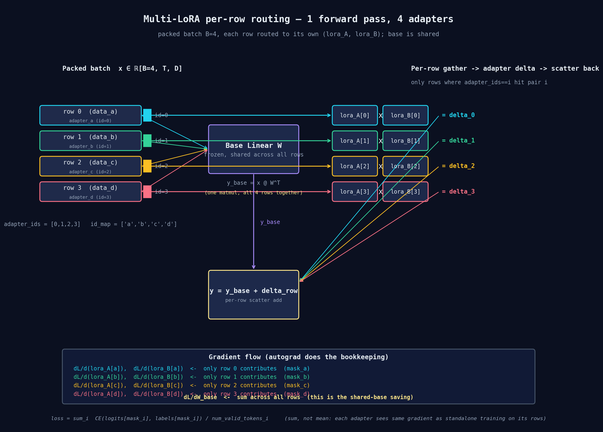
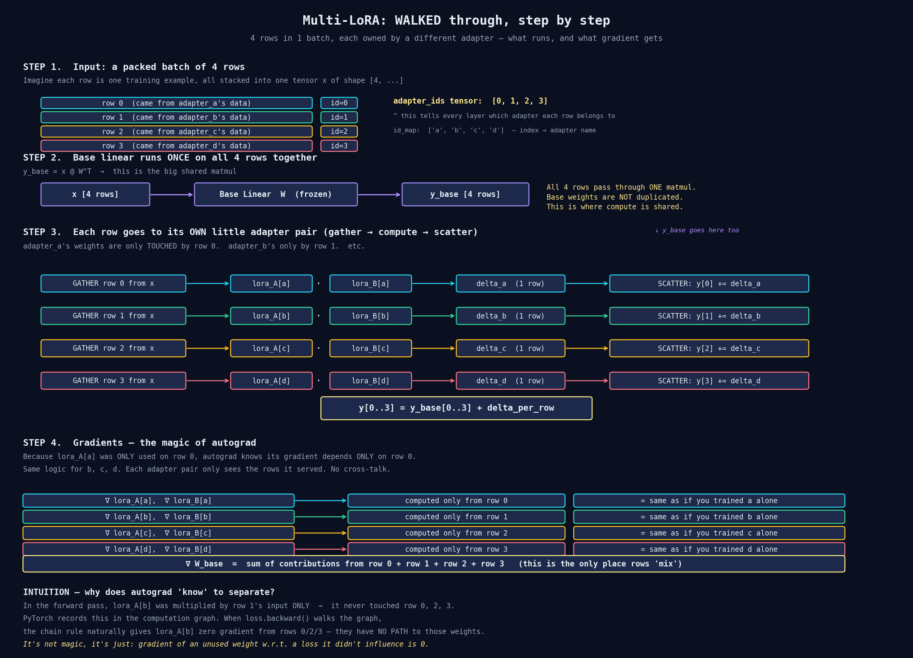

# nousnet-diagrams

Public diagrams and visual notes for the [nousnet](https://github.com/NousResearch/nousnet) library.

## Multi-LoRA per-row routing

How K LoRA adapters share one forward pass over a packed batch — each row is routed to its own `(lora_A, lora_B)` pair via gather/scatter, while the base linear runs once for everyone. Autograd separates the gradients automatically because each adapter's weights are only invoked on the rows belonging to that adapter.

**Key idea**: 1 forward pass, 1 base matmul shared across all rows, K small adapter pairs each touching only its own rows. `∂L/∂(lora_A[i])` is non-zero only on rows where `adapter_ids == i`. The base sees the sum across all rows.

## Step-by-step walkthrough

A more detailed version that walks through what actually happens in each step — gather, base matmul, per-adapter delta, scatter back, and finally the gradient story.

**The key intuition**: in the forward pass, `lora_A[b]` is *only* invoked on row 1. PyTorch's autograd records this. When you call `loss.backward()`, the chain rule naturally gives `lora_A[b]` zero gradient from rows 0, 2, 3 — they have no path to those weights. It's not a special routing trick; it's just: the gradient of a weight that didn't influence a loss is zero.
